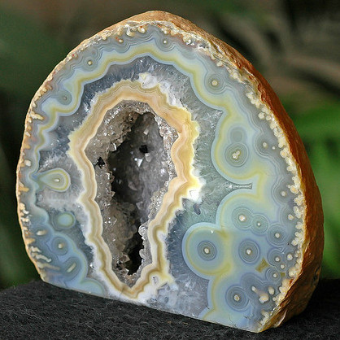
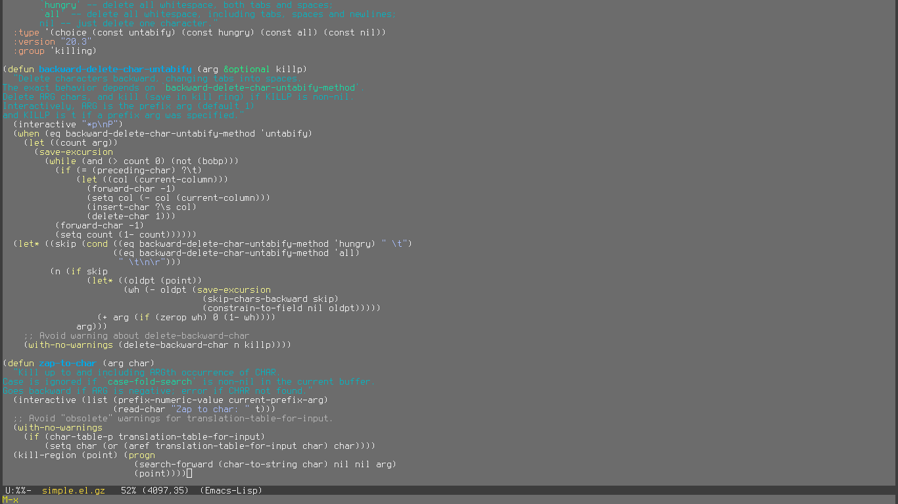
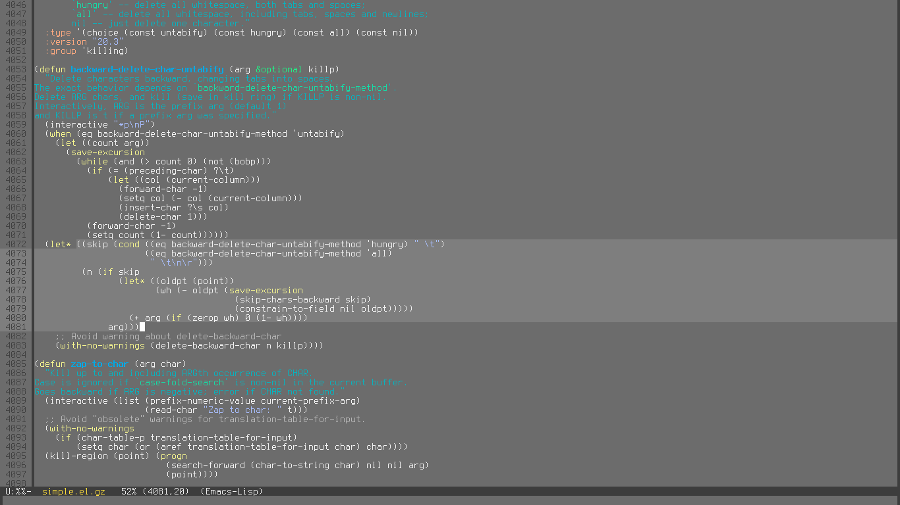
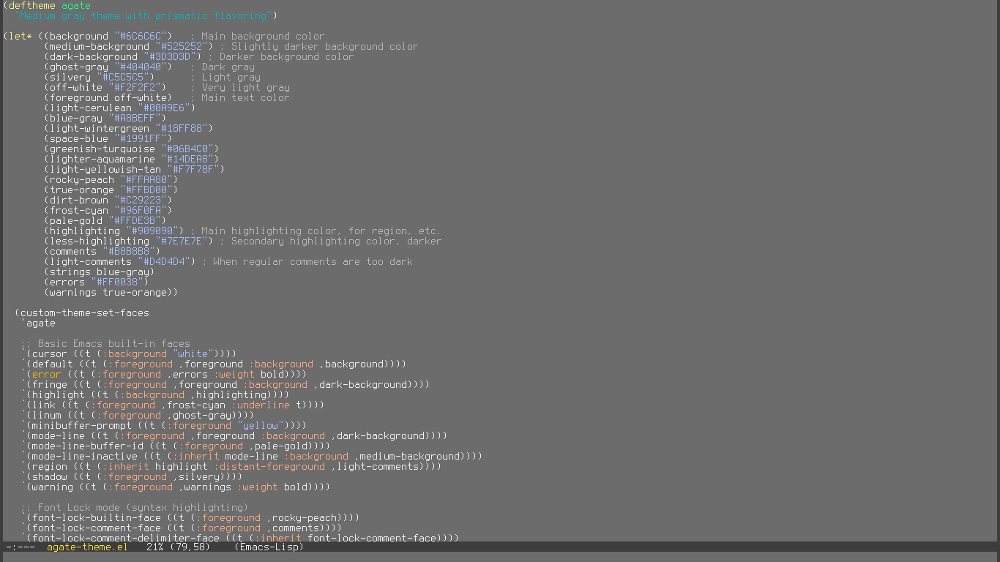

Agate
=====

Agate is a medium gray color theme for Emacs. It's not dark, but neither is it
very light. It's just right. It has a wide, balanced color palette and special
support for certain modes whose default use of `font-lock` faces wouldn't look
good otherwise.

Why should you use Agate?

* The low-contrast colors are mainly in the middle of the brightness scale,
  meaning it's easy on the eyes under any light conditions.
* It allows you to really appreciate the crystalline structure of your code.
* The colors just "pop" out from the background.
* It's simple, yet full of surprises!

Modes with special support:

* LaTeX
* Show Paren

Screenshots
-----------

###Emacs Lisp###

> Viewing `simple.el`.

> Viewing `simple.el` with `linum-mode` and `show-paren-mode` turned on.

> Viewing the source code of Agate with itself.
